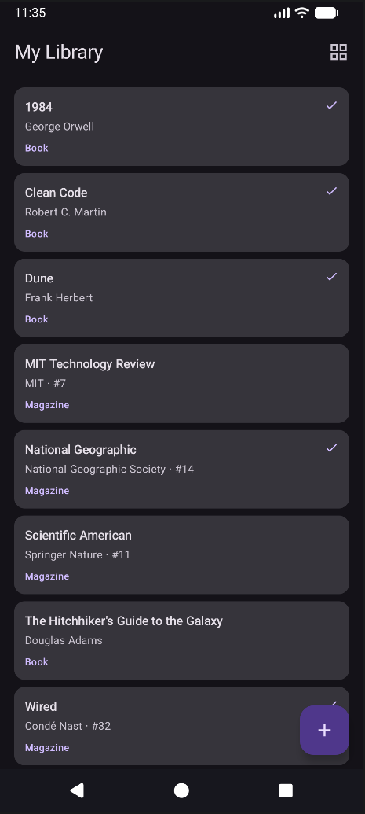
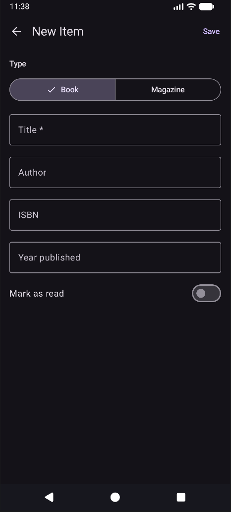
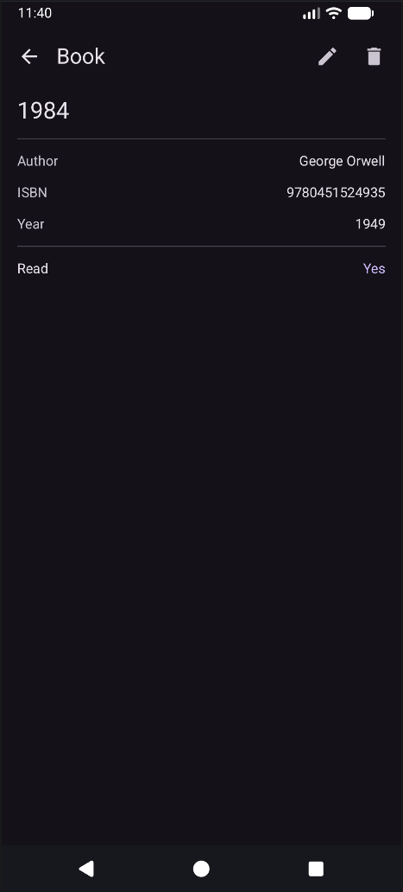

# Mobile Library

An Android app for managing a personal library of books and magazines, built with Kotlin and Jetpack Compose.

## Features

- Add, view, edit, and delete books and magazines
- Track read/unread status for books
- Switch between list and grid view
- Persistent local storage with Room database

## Screenshots







## Tech Stack

- **Language:** Kotlin
- **UI:** Jetpack Compose + Material 3
- **Architecture:** MVVM (ViewModel + StateFlow)
- **Navigation:** Navigation Compose
- **Database:** Room (SQLite)
- **DI:** Manual dependency injection via AppContainer

## Requirements

- Android Studio Hedgehog or later
- Android SDK 26+
- JDK 17

## Getting Started

1. Clone the repository:
   ```bash
   git clone https://github.com/eugene-chekan/mobile-library.git
   ```
2. Open in Android Studio
3. Run on an emulator or physical device (API 26+)

## License

MIT — see [LICENSE](LICENSE)
